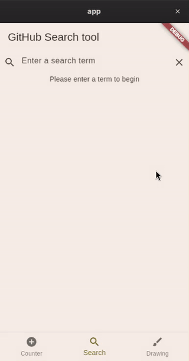

# Learning journal of Cross-platform mobile application development course

***
9.5.2026

### Unit tests

Bloc has its own packaging for testing bloc and they seem to have  it figured out too. Writing unit tests on blocs is a breeze and complex features can get robustly tested with ease.

```dart
import 'package:mocktail/mocktail.dart';

import 'package:bloc_test/bloc_test.dart';
import 'package:common_github_search/common_github_search.dart';
import 'package:test/test.dart';

void main() {
  group(GithubSearchBloc, () {
    late MockGithubRepository mockRepository;
    late GithubSearchBloc search;

    setUp(() {
      mockRepository = MockGithubRepository();
      search = GithubSearchBloc(githubRepository: mockRepository);
      print('→ Starting a new GithubSearchBloc test');
    });

    tearDown(() => search.close());

    blocTest(
      'Search bloc smoke test',
      build: () => search,
      act: (search) => search.add(const TextChanged(text: '')),
      expect: () => [isA<SearchStateInitial>()],
      wait: const Duration(milliseconds: 350),
    );

    blocTest(
      'Search bloc searching test',
      build: () {
        when(
          () => mockRepository.search('flutter'),
        ).thenAnswer((_) async => createMockSearchResult());

        return search;
      },
      act: (search) => search.add(const TextChanged(text: 'flutter')),
      expect: () => [isA<SearchStateLoading>(), isA<SearchStateSuccess>()],
      wait: const Duration(milliseconds: 350),
      verify: (_) {
        verify(() => mockRepository.search('flutter')).called(1);
      },
    );

    blocTest(
      'Search bloc error handling test',
      build: () {
        when(
          () => mockRepository.search('badterm'),
        ).thenThrow(createMockSearchError(message: 'The error'));

        return search;
      },
      act: (search) => search.add(const TextChanged(text: 'badterm')),
      expect: () => [
        isA<SearchStateLoading>(),
        predicate<SearchStateError>((state) => state.error == 'The error'),
      ],
      wait: const Duration(milliseconds: 350),
      verify: (_) => verify(() => mockRepository.search('badterm')).called(1),
    );
  });
}
```


It truely amazes me when learning a high level language it always goes into "How do I implement this, probably some specific delegate function. Oh, there is a ready made solution to this."

```dart
when(() => {
	.askedSomething()
}).thenAnswer(() => Yes());
```

That is the whole point of high level languages though. In exchange for complex mess, you get great development speed once familiar with the tooling.

To further extend the widget tests for the github search, I went and used the newly created mock repositories in the widget tests instead of real one. This allows me to actually now test the search entries being added to ui without actually calling the api in the tests. 

To verify what the test should see, I added a env var flag to the  build to enable the mock repository instead of the real one. This way I can see for my self what the tests should see.

```bash
flutter run --dart-define=USE_MOCK=true
```



I added a one new widget test for the search to validate that the app renders the search results after search.


***

8.5.2026

### Testing UI

After skimming trough the links from moodle about testing, I went straight into the project app and tried out the boiler plate tests. From there on I started to extend the existing setup for the counter app.

Nothing really works intuitively, but I found that LLMs provides working example snippets way faster and easier than trying to search ready example from stackoverflow or other ancient platform. The problems and gymnasts that you usually try to do on the Flutters widget tests, are often quite specific, so they are hard to find the old way. In comes the further most advanced search machines of LLMs.

Tests are something that always feels lame when you think about that you have to start writing them, but once in place and every test runs successfully and as intended, it makes you feel better, the development cycle is more robust now, you can trust more the machinery of your CI pipeline and what comes out from it.

```bash
$  flutter test
00:06 +0: SearchPage Search smoke test
→ Starting a new SearchPage test
00:07 +1: SearchPage Search type test
→ Starting a new SearchPage test
00:07 +2: SearchPage Clear search test
→ Starting a new SearchPage test
00:07 +3: CounterPage Counter smoke test
→ Starting a new CounterPage test
00:07 +4: CounterPage Counter increment test
→ Starting a new CounterPage test
Instance of 'CounterIncrementPressed'
Transition { currentState: 0, event: Instance of 'CounterIncrementPressed', nextState: 1 }
Change { currentState: 0, nextState: 1 }
Instance of 'CounterIncrementPressed'
Transition { currentState: 1, event: Instance of 'CounterIncrementPressed', nextState: 2 }
Change { currentState: 1, nextState: 2 }
00:07 +5: CounterPage Counter decrement test
→ Starting a new CounterPage test
Instance of 'CounterIncrementPressed'
Transition { currentState: 0, event: Instance of 'CounterIncrementPressed', nextState: 1 }
Change { currentState: 0, nextState: 1 }
Instance of 'CounterDecrementPressed'
Transition { currentState: 1, event: Instance of 'CounterDecrementPressed', nextState: 0 }
Change { currentState: 1, nextState: 0 }
00:07 +6: CounterPage Counter decrement constraint test
→ Starting a new CounterPage test
Instance of 'CounterDecrementPressed'
Transition { currentState: 0, event: Instance of 'CounterDecrementPressed', nextState: 0 }
Change { currentState: 0, nextState: 0 }
00:07 +7: DrawingPage Drawing Page smoke test
→ Starting a new DrawingPage test
00:07 +8: DrawingPage adds a point to drawing
→ Starting a new DrawingPage test
00:07 +9: All tests passed!
```

All of the widget tests of each three pages are under the same file and I think one file suffice for each field of testing in this sized project.

``` dart
import 'package:app/counter_bloc.dart';
import 'package:app/counter_page.dart';
import 'package:app/drawing.dart';
import 'package:app/search/search_page.dart';
import 'package:common_github_search/common_github_search.dart';
import 'package:flutter/material.dart';
import 'package:flutter_bloc/flutter_bloc.dart';
import 'package:flutter_test/flutter_test.dart';

void main() {
  group('SearchPage', () {
    late Widget search;

    setUp(() {
      search = RepositoryProvider(
        create: (_) => GithubRepository(),
        child: MaterialApp(home: const SearchPage()),
      );
      print('→ Starting a new SearchPage test');
    });

    testWidgets('Search smoke test', (WidgetTester tester) async {
      await tester.pumpWidget(search);

      expect(find.text('Please enter a term to begin'), findsOne);
      expect(find.byType(TextField), findsOne);
    });

    testWidgets('Search type test', (
      WidgetTester tester,
    ) async {
      await tester.pumpWidget(search);

      final textField = find.byType(TextField);

      await tester.enterText(textField, "flutter");

      // wait for debounce
      await tester.pump(const Duration(milliseconds: 350));
      await tester.pumpAndSettle();

      expect(find.text('flutter'), findsOneWidget);
    });

    testWidgets('Clear search test', (
      WidgetTester tester,
    ) async {
      await tester.pumpWidget(search);

      final textField = find.byType(TextField);

      await tester.enterText(textField, "flutter");

      await tester.pump(const Duration(milliseconds: 350));
      await tester.pumpAndSettle();

      await tester.tap(find.byIcon(Icons.clear));

      await tester.pump(const Duration(milliseconds: 350));
      await tester.pumpAndSettle();

      expect(find.text(''), findsOneWidget);
    });


  });

  group('CounterPage', () {
    late Widget counter;

    setUp(() {
      counter = BlocProvider(
        create: (_) => CounterBloc(),
        child: MaterialApp(home: CounterPage()),
      );
      print('→ Starting a new CounterPage test');
    });

    testWidgets('Counter smoke test', (WidgetTester tester) async {
      await tester.pumpWidget(counter);

      expect(find.text('0'), findsOneWidget);
      expect(find.text('1'), findsNothing);
    });

    testWidgets('Counter increment test', (WidgetTester tester) async {
      await tester.pumpWidget(counter);

      await tester.tap(find.byIcon(Icons.add));
      await tester.pump();

      expect(find.text('0'), findsNothing);
      expect(find.text('1'), findsOneWidget);

      await tester.tap(find.byIcon(Icons.add));
      await tester.pump();

      expect(find.text('0'), findsNothing);
      expect(find.text('1'), findsNothing);
      expect(find.text('2'), findsOneWidget);
    });

    testWidgets('Counter decrement test', (WidgetTester tester) async {
      await tester.pumpWidget(counter);

      expect(find.text('0'), findsOneWidget);
      expect(find.text('1'), findsNothing);

      await tester.tap(find.byIcon(Icons.add));
      await tester.pump();

      expect(find.text('0'), findsNothing);
      expect(find.text('1'), findsOneWidget);

      await tester.tap(find.byIcon(Icons.remove));
      await tester.pump();

      expect(find.text('1'), findsNothing);
      expect(find.text('0'), findsOneWidget);
    });

    testWidgets('Counter decrement constraint test', (
      WidgetTester tester,
    ) async {
      await tester.pumpWidget(counter);

      expect(find.text('0'), findsOneWidget);
      expect(find.text('1'), findsNothing);

      await tester.tap(find.byIcon(Icons.remove));
      await tester.pump();

      expect(find.text('1'), findsNothing);
      expect(find.text('-1'), findsNothing);
      expect(find.text('0'), findsOneWidget);
    });
  });

  group('DrawingPage', () {
    late Widget drawing;

    setUp(() {
      drawing = MaterialApp(home: const DrawingPage(title: 'Drawing'));
      print('→ Starting a new DrawingPage test');
    });

    testWidgets('Drawing Page smoke test', (WidgetTester tester) async {
      await tester.pumpWidget(drawing);

      final state = tester.state<DrawingPageState>(find.byType(DrawingPage));

      expect(find.byIcon(Icons.brush), findsOneWidget);
      expect(state.points.length, 0);
    });

    testWidgets('adds a point to drawing', (WidgetTester tester) async {
      await tester.pumpWidget(drawing);

      final state = tester.state<DrawingPageState>(find.byType(DrawingPage));

      await tester.tap(find.byIcon(Icons.brush));
      await tester.pump();

      expect(state.points.length, 1);
    });
  });
}
```


***

20.4.2026

### Refactoring the architecture

I started to form the architecture more towards MVVM, but keep the bloc as domain layer orchestrator. Bloc works kinda like the use cases on a pure MVVM structure. I created extra layer on the presentation by adding a view model for the displayed page, that handles all the business logic and the UI is completely freed from handling any business logic, thus enforcing the MVVM architecture.
```
          App Layer                                Domain Layer                Data Layer     
───────────────────────────────                ─────────────────────        ──────────────────
┌─────────┐       ┌───────────┐                ┌───────────────────┐           ┌───────┐      
│  Page   │       │View Model │                │  Bloc             ├──────────►│  API  │      
│         │       │           │    states      │    ┌────────┐     │           └───────┘      
│         │◄──────┼───────────┼────────────────┼─── │cache,  │     │                          
│         │       │           │                │    │repo,   │     │                          
│         │       │           │                │    │etc..   │     │                          
│         │       │           │    events      │    └────────┘     │                          
│    ─────┼───────┼───────────┼───────────────►│                   │                          
└─────────┘       └───────────┘                └───────────────────┘                          
```
***

13.4.2026

### About architecture

Reading into compass apps code the first tough is, its obviously well structured. 

[https://github.com/flutter/samples/tree/main/compass_app](https://github.com/flutter/samples/tree/main/compass_app)

The vastness of callable and returnable mock data makes the dev experience close to what the api would return. Although I didnt catch any flutter specific here, just about the same I have for example done in past for some projects but not with flutter.

The model factory with input of json seems ergonomic way to handle model creation for the views. No need to manually write the parsing ourselves. I guess this is where the frameworks shine the most. They provide tooling to ease the development, but you have to be familiar with it to know that the tools for the job already exists in the framework.

The use cases were somewhat new concept to me. I’ve seen them, but never really thought about them much. Having an orchestration layer that handles all the moving parts fits clean architecture ideology well. By containing this job in its own layer, business logic moves out of the UI and into a dedicated place.

***
7.4.2026

I finished following the state manager building and after that I moved on to implement the bloc to the project.
Bloc seems a great tool managaing the state of the application and it has solid idea behind it which resonates with me.
I read trough the introduction part of the bloc docs and followed the trough the code examples of counter and github search.
It really seems like a library I would go with when working on a flutter app.
I think this satisfies the L5 subject as we do now HTTP POST on a API with async item loading.


***
24.3.2026

### State management and ecosystem

After a long break between the lectures, a refresher in flutter was in place.
While having the lecture on my second monitor where subject was orbiting around UI widgets, 
I spent most of my time browsing the pub.dev page to see what are the popular packages people use with the flutter.
This gave me ideas and insight on what I can implement easily by importing the library to the project instead of building it myself or leaving the feature out of the scope.
I even found few packages which I saved for future projects where I might use flutter to build it.

The UI stuff was very helpful since I feel that you cant really utilize the knowledge on plain web technologies with mobile apps too much, so it's great to see whats out there.
I feel that the only way to get around with a new frontend framework effectively is to browse the docs, which I haven't got around yet.

The insight for state management and flutters way to use the state was also very helpful. I got a better understanding on usefulness of a app state.


***

12.2.2026

Attended to the lecture today and we went trough following the Dart tutorial. The tutorial felt really basic and at first it wasnt giving anything new to me.
***

22.01.2026

### Getting the ropes

Today I just went in on the demo app and tried out what happens on the things and how to add content of my own. I found the similiarity to the Kotlin android application development and that helped. The framework seems to provide nice set of tools to make things happen but way less verbose than in the Kotlin code.
For example the simple and good looking page navigator was way easier to craft.

I also tried a new agentic AI neovim plugin tool, which allows to run agent inline from the editor by selecting the relevant context by VIM visual mode. It is kinda more lightweight than something like opencode that runs freely on context of the whole project. The zig zag drawing page that was created today was created by this way using Grok code fast 1 model.


***

21.01.2026

### Getting to know the tool


Last time I left on after initializing the new flutter app and looked up the tools used on flutter development.

Flutter sdk seems intuitive, but the official quick start guide was weird to say at least. The instructions doesn't say a thing on anything else than installing and using VS Code, despite they having a perfectly fine CLI tool that is easy to use.
Kinda same as you would be in a market for a new car and start looking into Mercedes-Benz and the dealer tells you to go get a taxi ride as they probably drive a new Mercedes.

Delving deeper in to the ecosystem here I see handy tools in the web interface DevTools. It brings comfort in knowing that the sdk provides niceties from the web dev into play.


***

20.01.2026

### Initialization

Going into this courses completion, I'll state that I already do have some experience in cross-platform development. I've priorly used React Native for mobile app development and Tauri for desktop app development in my personal learning projects. 

After the initial lecture of the course, and looking more into the options presented on the lecture, I've drawn a conclusion about the technology I want to use on this course. 
Much like the frameworks I mentioned earlier, many other cross-platforms also tend to cater towards enforcing the usage of familiar web technologies to develope native applications and that doesn't feel like a option that would interest me right now. 
So the most interesting technology to me on the table is the one that was kinda default already on the course, Flutter.
Flutter seems most versatile tool to me since it's capabilities in making most native apps out of the options and yet still compiling also to web format. Also since I do have tried out the two second most interesting options already, I figured why not. 

